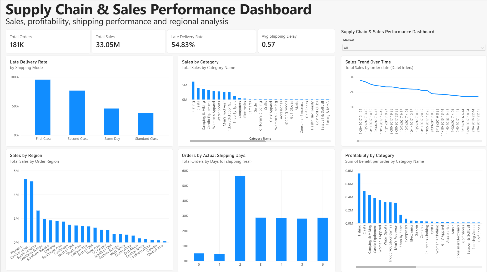

# Supply Chain & Sales Performance Analytics

An end-to-end supply chain analytics project analyzing 180K+ transaction records to evaluate delivery performance, shipping efficiency, sales trends, regional performance, customer segments, and product profitability.

The project combines **Python, SQL (DuckDB), and Power BI** to transform raw supply chain data into business-focused analysis and an interactive analytics dashboard.

---

## 📊 Power BI Dashboard

The interactive Power BI dashboard provides a consolidated view of supply chain and sales performance.



### Dashboard Metrics & Analysis

- Total Orders
- Total Sales
- Late Delivery Rate
- Average Shipping Delay
- Late Delivery Rate by Shipping Mode
- Sales by Product Category
- Sales Trend Over Time
- Sales by Region
- Orders by Actual Shipping Days
- Profitability by Category
- Market-level filtering

---

## 🎯 Business Objectives

- Measure overall delivery and cancellation performance
- Identify shipping modes with higher late-delivery rates
- Compare delivery performance across markets and regions
- Analyze scheduled vs. actual shipping duration
- Identify shipping delay patterns
- Evaluate sales performance by category and region
- Compare sales performance across customer segments
- Analyze profitability across product categories

---

## 🛠️ Tools & Technologies

| Tool | Purpose |
|---|---|
| **Python** | Data preparation, validation, profiling, and KPI calculation |
| **SQL / DuckDB** | Analytical queries, aggregations, and performance analysis |
| **Power BI** | Interactive dashboard development and visualization |
| **Git & GitHub** | Version control and project portfolio management |

---

## 📈 Key Findings

- Analyzed **180,519 supply chain transaction records**
- Identified **172,765 delivery records** and **7,754 cancelled records**
- Overall late-delivery rate was **54.83%**
- **First Class** shipping recorded the highest late-delivery rate at approximately **95%**
- **Standard Class** accounted for the largest delivery volume
- Shipping performance varied across different shipping durations
- **Consumer** customers represented the largest customer segment by sales
- **Fishing** generated the highest sales among the analyzed product categories
- Regional sales performance showed significant variation across markets and regions
- Product-category profitability was concentrated among the leading categories

---

## 🔍 Analytical Work

### Delivery & Service-Level Analysis

Analyzed delivery performance using:

- Late delivery rate
- Shipping mode
- Delivery status
- Scheduled vs. actual shipping duration
- Actual shipping days
- Delay distribution

### Sales Analysis

Evaluated:

- Sales by product category
- Sales by region
- Sales trends over time
- Sales by market
- Customer segment performance

### Profitability Analysis

Compared category-level profitability to identify:

- Highest-profit categories
- Lower-performing categories
- Concentration of profit across product categories

---

## 🗄️ SQL Analysis

The project includes SQL queries covering:

1. Service-level performance
2. Market performance
3. Regional performance
4. Service-level performance by market
5. Scheduled vs. actual shipping duration
6. Shipping delay distribution
7. Category performance
8. Customer segment performance

The resulting analytical datasets are available in the `outputs/` directory.

---

## 🐍 Python Workflow

Python scripts were used to support the analytical workflow:

- `prepare_data.py` — Data preparation and transformation
- `profile_data.py` — Dataset profiling and quality checks
- `calculate_kpis.py` — KPI calculation
- `validate_delivery_logic.py` — Delivery and shipping logic validation
- `run_sql.py` — SQL execution workflow

---

## 📁 Project Structure

```text
supply-chain-delivery-analytics/
│
├── outputs/
│   ├── service_level_performance.csv
│   ├── market_performance.csv
│   ├── 03_region_performance.csv
│   ├── service_level_by_market.csv
│   ├── 05_scheduled_vs_actual.csv
│   ├── 06_delay_distribution.csv
│   ├── 07_category_performance.csv
│   └── 08_customer_segment_performance.csv
│
├── screenshots/
│   └── dashboard.png
│
├── sql/
│   ├── 01_service_level_performance.sql
│   ├── 02_market_performance.sql
│   ├── 03_region_performance.sql
│   ├── 04_service_level_by_market.sql
│   ├── 05_scheduled_vs_actual.sql
│   ├── 06_delay_distribution.sql
│   ├── 07_category_performance.sql
│   └── 08_customer_segment_performance.sql
│
├── src/
│   ├── calculate_kpis.py
│   ├── prepare_data.py
│   ├── profile_data.py
│   ├── run_sql.py
│   └── validate_delivery_logic.py
│
├── Supply_Chain_Sales_Performance_Dashboard.pbix
├── requirements.txt
├── .gitignore
└── README.md